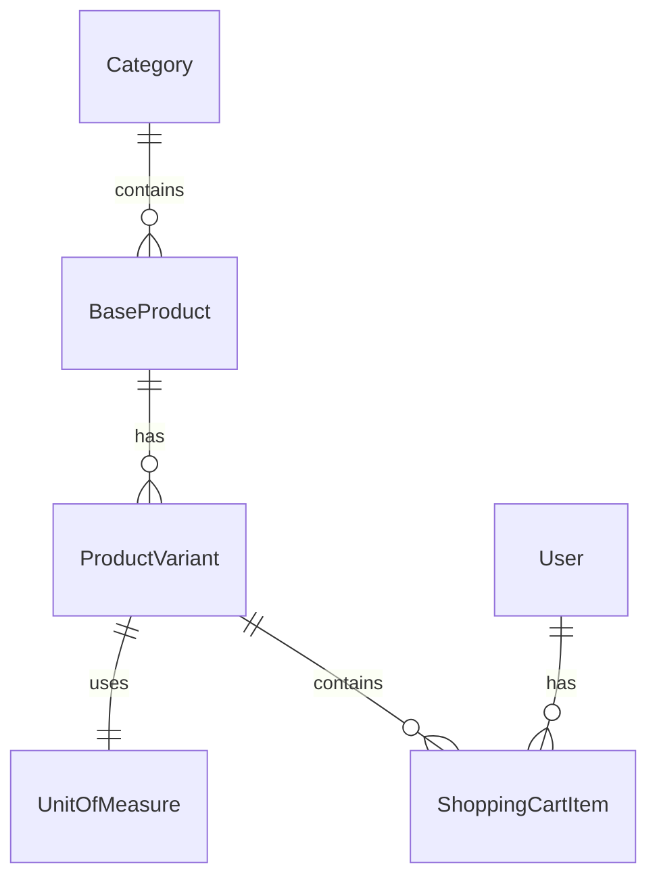

# Product-Variant Model Design Document

## Overview
This document outlines the design for a new product-variant model to replace the existing Material entity. The design follows standard e-commerce patterns with base products having multiple variants, incorporating unit of measure management and shopping cart functionality.

## Current Material Entity Analysis
The existing Material entity has the following key properties:
- Id (Guid)
- Name (string)
- Description (string?)
- StockQuantity (decimal)
- CategoryId (Guid?)
- Category (navigation)
- UnitType (string) - e.g., "mm", "gr", "Litre"
- UnitValue (decimal)
- UsageNotes (string?)
- Photos (List<string>)
- DynamicProperties (Dictionary<string, object>)
- CreatedAt, UpdatedAt (DateTime)

## New Entity Designs

### BaseProduct Entity
Represents the base product that can have multiple variants.

```csharp
using System;
using System.Collections.Generic;
using System.ComponentModel.DataAnnotations;

namespace FunnyActivities.Domain.Entities
{
    /// <summary>
    /// Represents a base product that can have multiple variants.
    /// </summary>
    public class BaseProduct
    {
        /// <summary>
        /// Gets the unique identifier of the base product.
        /// </summary>
        public Guid Id { get; private set; }

        /// <summary>
        /// Gets the name of the base product.
        /// </summary>
        public string Name { get; private set; }

        /// <summary>
        /// Gets the description of the base product.
        /// </summary>
        public string? Description { get; private set; }

        /// <summary>
        /// Gets the category ID of the base product.
        /// </summary>
        public Guid? CategoryId { get; private set; }

        /// <summary>
        /// Gets the category of the base product.
        /// </summary>
        public Category? Category { get; private set; }

        /// <summary>
        /// Gets the date and time when the base product was created.
        /// </summary>
        public DateTime CreatedAt { get; private set; }

        /// <summary>
        /// Gets the date and time when the base product was last updated.
        /// </summary>
        public DateTime UpdatedAt { get; private set; }

        /// <summary>
        /// Gets the collection of variants for this base product.
        /// </summary>
        public ICollection<ProductVariant> Variants { get; private set; }

        /// <summary>
        /// Initializes a new instance of the <see cref="BaseProduct"/> class.
        /// </summary>
        /// <param name="id">The unique identifier.</param>
        /// <param name="name">The name of the base product.</param>
        /// <param name="description">The description of the base product.</param>
        /// <param name="categoryId">The category ID.</param>
        public BaseProduct(Guid id, string name, string? description, Guid? categoryId)
        {
            Id = id;
            Name = name;
            Description = description;
            CategoryId = categoryId;
            CreatedAt = DateTime.UtcNow;
            UpdatedAt = DateTime.UtcNow;
            Variants = new List<ProductVariant>();
        }

        /// <summary>
        /// Private constructor for EF Core.
        /// </summary>
        private BaseProduct() { }

        /// <summary>
        /// Creates a new base product instance.
        /// </summary>
        /// <param name="name">The name of the base product.</param>
        /// <param name="description">The description of the base product.</param>
        /// <param name="categoryId">The category ID.</param>
        /// <returns>A new base product instance.</returns>
        public static BaseProduct Create(string name, string? description, Guid? categoryId)
        {
            return new BaseProduct(Guid.NewGuid(), name, description, categoryId);
        }

        /// <summary>
        /// Updates the details of the base product.
        /// </summary>
        /// <param name="name">The new name.</param>
        /// <param name="description">The new description.</param>
        /// <param name="categoryId">The new category ID.</param>
        public void UpdateDetails(string name, string? description, Guid? categoryId)
        {
            Name = name;
            Description = description;
            CategoryId = categoryId;
            UpdatedAt = DateTime.UtcNow;
        }
    }
}
```

### ProductVariant Entity
Represents specific variants of a base product.

```csharp
using System;
using System.Collections.Generic;
using System.ComponentModel.DataAnnotations;

namespace FunnyActivities.Domain.Entities
{
    /// <summary>
    /// Represents a specific variant of a base product.
    /// </summary>
    public class ProductVariant
    {
        /// <summary>
        /// Gets the unique identifier of the product variant.
        /// </summary>
        public Guid Id { get; private set; }

        /// <summary>
        /// Gets the base product ID.
        /// </summary>
        public Guid BaseProductId { get; private set; }

        /// <summary>
        /// Gets the base product.
        /// </summary>
        public BaseProduct BaseProduct { get; private set; }

        /// <summary>
        /// Gets the name of the variant (e.g., "Red - Small").
        /// </summary>
        public string Name { get; private set; }

        /// <summary>
        /// Gets the current stock quantity of the variant.
        /// </summary>
        public decimal StockQuantity { get; private set; }

        /// <summary>
        /// Gets the unit of measure ID.
        /// </summary>
        public Guid UnitOfMeasureId { get; private set; }

        /// <summary>
        /// Gets the unit of measure.
        /// </summary>
        public UnitOfMeasure UnitOfMeasure { get; private set; }

        /// <summary>
        /// Gets the unit value of the variant.
        /// </summary>
        public decimal UnitValue { get; private set; }

        /// <summary>
        /// Gets the usage notes for the variant.
        /// </summary>
        public string? UsageNotes { get; private set; }

        /// <summary>
        /// Gets the list of photo URLs for the variant.
        /// </summary>
        public List<string> Photos { get; private set; }

        /// <summary>
        /// Gets the dynamic properties for the variant.
        /// </summary>
        public Dictionary<string, object> DynamicProperties { get; private set; }

        /// <summary>
        /// Gets the date and time when the variant was created.
        /// </summary>
        public DateTime CreatedAt { get; private set; }

        /// <summary>
        /// Gets the date and time when the variant was last updated.
        /// </summary>
        public DateTime UpdatedAt { get; private set; }

        /// <summary>
        /// Initializes a new instance of the <see cref="ProductVariant"/> class.
        /// </summary>
        /// <param name="id">The unique identifier.</param>
        /// <param name="baseProductId">The base product ID.</param>
        /// <param name="name">The name of the variant.</param>
        /// <param name="stockQuantity">The stock quantity.</param>
        /// <param name="unitOfMeasureId">The unit of measure ID.</param>
        /// <param name="unitValue">The unit value.</param>
        /// <param name="usageNotes">The usage notes.</param>
        public ProductVariant(Guid id, Guid baseProductId, string name, decimal stockQuantity, Guid unitOfMeasureId, decimal unitValue, string? usageNotes)
        {
            Id = id;
            BaseProductId = baseProductId;
            Name = name;
            StockQuantity = stockQuantity;
            UnitOfMeasureId = unitOfMeasureId;
            UnitValue = unitValue;
            UsageNotes = usageNotes;
            Photos = new List<string>();
            DynamicProperties = new Dictionary<string, object>();
            CreatedAt = DateTime.UtcNow;
            UpdatedAt = DateTime.UtcNow;
        }

        /// <summary>
        /// Private constructor for EF Core.
        /// </summary>
        private ProductVariant() { }

        /// <summary>
        /// Creates a new product variant instance.
        /// </summary>
        /// <param name="baseProductId">The base product ID.</param>
        /// <param name="name">The name of the variant.</param>
        /// <param name="stockQuantity">The stock quantity.</param>
        /// <param name="unitOfMeasureId">The unit of measure ID.</param>
        /// <param name="unitValue">The unit value.</param>
        /// <param name="usageNotes">The usage notes.</param>
        /// <returns>A new product variant instance.</returns>
        public static ProductVariant Create(Guid baseProductId, string name, decimal stockQuantity, Guid unitOfMeasureId, decimal unitValue, string? usageNotes)
        {
            return new ProductVariant(Guid.NewGuid(), baseProductId, name, stockQuantity, unitOfMeasureId, unitValue, usageNotes);
        }

        /// <summary>
        /// Updates the stock quantity of the variant.
        /// </summary>
        /// <param name="newQuantity">The new stock quantity.</param>
        public void UpdateStock(decimal newQuantity)
        {
            if (newQuantity < 0)
                throw new ArgumentException("Stock quantity cannot be negative.", nameof(newQuantity));

            StockQuantity = newQuantity;
            UpdatedAt = DateTime.UtcNow;
        }

        /// <summary>
        /// Updates the details of the variant.
        /// </summary>
        /// <param name="name">The new name.</param>
        /// <param name="unitOfMeasureId">The new unit of measure ID.</param>
        /// <param name="unitValue">The new unit value.</param>
        /// <param name="usageNotes">The new usage notes.</param>
        public void UpdateDetails(string name, Guid unitOfMeasureId, decimal unitValue, string? usageNotes)
        {
            Name = name;
            UnitOfMeasureId = unitOfMeasureId;
            UnitValue = unitValue;
            UsageNotes = usageNotes;
            UpdatedAt = DateTime.UtcNow;
        }

        /// <summary>
        /// Validates the stock quantity.
        /// </summary>
        /// <returns>True if the stock quantity is valid; otherwise, false.</returns>
        public bool ValidateStock()
        {
            return StockQuantity >= 0;
        }
    }
}
```

### UnitOfMeasure Entity
Manages units of measurement.

```csharp
using System;
using System.ComponentModel.DataAnnotations;

namespace FunnyActivities.Domain.Entities
{
    /// <summary>
    /// Represents a unit of measure.
    /// </summary>
    public class UnitOfMeasure
    {
        /// <summary>
        /// Gets the unique identifier of the unit of measure.
        /// </summary>
        public Guid Id { get; private set; }

        /// <summary>
        /// Gets the name of the unit (e.g., "Millimeter").
        /// </summary>
        public string Name { get; private set; }

        /// <summary>
        /// Gets the symbol of the unit (e.g., "mm").
        /// </summary>
        public string Symbol { get; private set; }

        /// <summary>
        /// Gets the type of the unit (e.g., "Length", "Weight", "Volume").
        /// </summary>
        public string Type { get; private set; }

        /// <summary>
        /// Gets the date and time when the unit was created.
        /// </summary>
        public DateTime CreatedAt { get; private set; }

        /// <summary>
        /// Gets the date and time when the unit was last updated.
        /// </summary>
        public DateTime UpdatedAt { get; private set; }

        /// <summary>
        /// Initializes a new instance of the <see cref="UnitOfMeasure"/> class.
        /// </summary>
        /// <param name="id">The unique identifier.</param>
        /// <param name="name">The name of the unit.</param>
        /// <param name="symbol">The symbol of the unit.</param>
        /// <param name="type">The type of the unit.</param>
        public UnitOfMeasure(Guid id, string name, string symbol, string type)
        {
            Id = id;
            Name = name;
            Symbol = symbol;
            Type = type;
            CreatedAt = DateTime.UtcNow;
            UpdatedAt = DateTime.UtcNow;
        }

        /// <summary>
        /// Private constructor for EF Core.
        /// </summary>
        private UnitOfMeasure() { }

        /// <summary>
        /// Creates a new unit of measure instance.
        /// </summary>
        /// <param name="name">The name of the unit.</param>
        /// <param name="symbol">The symbol of the unit.</param>
        /// <param name="type">The type of the unit.</param>
        /// <returns>A new unit of measure instance.</returns>
        public static UnitOfMeasure Create(string name, string symbol, string type)
        {
            return new UnitOfMeasure(Guid.NewGuid(), name, symbol, type);
        }

        /// <summary>
        /// Updates the details of the unit.
        /// </summary>
        /// <param name="name">The new name.</param>
        /// <param name="symbol">The new symbol.</param>
        /// <param name="type">The new type.</param>
        public void UpdateDetails(string name, string symbol, string type)
        {
            Name = name;
            Symbol = symbol;
            Type = type;
            UpdatedAt = DateTime.UtcNow;
        }
    }
}
```

### ShoppingCartItem Entity
Represents items in a shopping cart.

```csharp
using System;
using System.ComponentModel.DataAnnotations;

namespace FunnyActivities.Domain.Entities
{
    /// <summary>
    /// Represents an item in a shopping cart.
    /// </summary>
    public class ShoppingCartItem
    {
        /// <summary>
        /// Gets the unique identifier of the cart item.
        /// </summary>
        public Guid Id { get; private set; }

        /// <summary>
        /// Gets the product variant ID.
        /// </summary>
        public Guid ProductVariantId { get; private set; }

        /// <summary>
        /// Gets the product variant.
        /// </summary>
        public ProductVariant ProductVariant { get; private set; }

        /// <summary>
        /// Gets the user ID.
        /// </summary>
        public Guid UserId { get; private set; }

        /// <summary>
        /// Gets the user.
        /// </summary>
        public User User { get; private set; }

        /// <summary>
        /// Gets the quantity of the item in the cart.
        /// </summary>
        public decimal Quantity { get; private set; }

        /// <summary>
        /// Gets the date and time when the item was added to the cart.
        /// </summary>
        public DateTime AddedAt { get; private set; }

        /// <summary>
        /// Initializes a new instance of the <see cref="ShoppingCartItem"/> class.
        /// </summary>
        /// <param name="id">The unique identifier.</param>
        /// <param name="productVariantId">The product variant ID.</param>
        /// <param name="userId">The user ID.</param>
        /// <param name="quantity">The quantity.</param>
        public ShoppingCartItem(Guid id, Guid productVariantId, Guid userId, decimal quantity)
        {
            Id = id;
            ProductVariantId = productVariantId;
            UserId = userId;
            Quantity = quantity;
            AddedAt = DateTime.UtcNow;
        }

        /// <summary>
        /// Private constructor for EF Core.
        /// </summary>
        private ShoppingCartItem() { }

        /// <summary>
        /// Creates a new shopping cart item instance.
        /// </summary>
        /// <param name="productVariantId">The product variant ID.</param>
        /// <param name="userId">The user ID.</param>
        /// <param name="quantity">The quantity.</param>
        /// <returns>A new shopping cart item instance.</returns>
        public static ShoppingCartItem Create(Guid productVariantId, Guid userId, decimal quantity)
        {
            return new ShoppingCartItem(Guid.NewGuid(), productVariantId, userId, quantity);
        }

        /// <summary>
        /// Updates the quantity of the cart item.
        /// </summary>
        /// <param name="quantity">The new quantity.</param>
        public void UpdateQuantity(decimal quantity)
        {
            if (quantity <= 0)
                throw new ArgumentException("Quantity must be greater than zero.", nameof(quantity));

            Quantity = quantity;
        }
    }
}
```

## Modifications to Existing Entities

### Category Entity
Add navigation property to BaseProducts:

```csharp
// In Category.cs, add:
public ICollection<BaseProduct> BaseProducts { get; private set; }

// In constructor:
BaseProducts = new List<BaseProduct>();
```

## Entity Relationships Diagram



## Migration Strategy

### Overview
The migration will transform existing Material entities into the new product-variant model. Each Material will become a BaseProduct with a single ProductVariant.

### Steps
1. **Create UnitOfMeasure entities**: Seed common units based on existing UnitType values in Materials.
2. **Create BaseProduct entities**: Migrate Material data to BaseProduct, excluding variant-specific properties.
3. **Create ProductVariant entities**: Create variants from Material data, mapping UnitType to UnitOfMeasure.
4. **Update Category navigation**: Add BaseProducts collection to Category.
5. **Remove Material entity**: After successful migration, remove the Material entity and related code.

### Sample Migration Code (EF Core)
```csharp
// In migration file
migrationBuilder.CreateTable(
    name: "UnitOfMeasures",
    // ... columns
);

migrationBuilder.CreateTable(
    name: "BaseProducts",
    // ... columns
);

migrationBuilder.CreateTable(
    name: "ProductVariants",
    // ... columns
);

migrationBuilder.CreateTable(
    name: "ShoppingCartItems",
    // ... columns
);

// Seed UnitOfMeasures
migrationBuilder.InsertData(
    table: "UnitOfMeasures",
    columns: new[] { "Id", "Name", "Symbol", "Type", "CreatedAt", "UpdatedAt" },
    values: new object[,]
    {
        { Guid.NewGuid(), "Millimeter", "mm", "Length", DateTime.UtcNow, DateTime.UtcNow },
        { Guid.NewGuid(), "Gram", "gr", "Weight", DateTime.UtcNow, DateTime.UtcNow },
        { Guid.NewGuid(), "Litre", "L", "Volume", DateTime.UtcNow, DateTime.UtcNow }
    }
);

// Migrate Materials to BaseProducts and ProductVariants
// This would require custom SQL or data seeding logic
```

### Data Mapping
- Material.Id → BaseProduct.Id
- Material.Name → BaseProduct.Name
- Material.Description → BaseProduct.Description
- Material.CategoryId → BaseProduct.CategoryId
- Material.CreatedAt → BaseProduct.CreatedAt
- Material.UpdatedAt → BaseProduct.UpdatedAt

For ProductVariant:
- New Guid → ProductVariant.Id
- Material.Id → ProductVariant.BaseProductId
- Material.Name → ProductVariant.Name (or generate variant name)
- Material.StockQuantity → ProductVariant.StockQuantity
- Map Material.UnitType to UnitOfMeasure.Id → ProductVariant.UnitOfMeasureId
- Material.UnitValue → ProductVariant.UnitValue
- Material.UsageNotes → ProductVariant.UsageNotes
- Material.Photos → ProductVariant.Photos
- Material.DynamicProperties → ProductVariant.DynamicProperties
- Material.CreatedAt → ProductVariant.CreatedAt
- Material.UpdatedAt → ProductVariant.UpdatedAt

## Implementation Considerations
1. **Data Integrity**: Ensure all foreign key relationships are maintained during migration.
2. **Unit Mapping**: Create a mapping table or logic to convert existing UnitType strings to UnitOfMeasure entities.
3. **Default Variants**: For Materials without variants, create a single default variant.
4. **Testing**: Thoroughly test the migration with sample data before production deployment.
5. **Rollback Plan**: Prepare a rollback strategy in case of migration issues.

This design provides a flexible product-variant structure that can accommodate future e-commerce features while maintaining compatibility with the existing domain model.